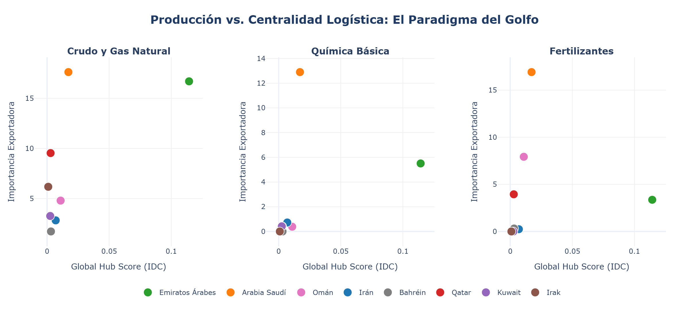
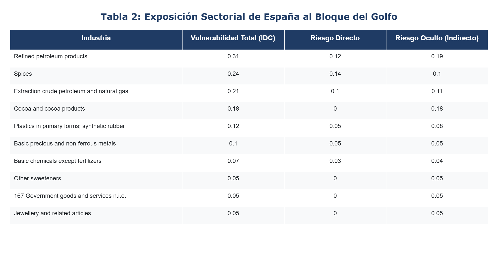
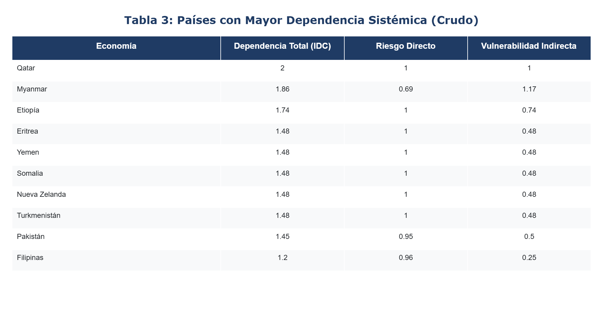

# Informe Especial: Vulnerabilidades Sistémicas ante la Disrupción del Estrecho de Ormuz

**Fecha:** 3 de marzo de 2026  
**Entidad:** Real Instituto Elcano - Análisis de Seguridad Económica  
**Metodología:** Índice de Dependencia Comercial (IDC)

 Informe Especial: Vulnerabilidades Sistémicas ante la Disrupción del Estrecho de Ormuz

Fecha: 3 de marzo de 2026  
Entidad: Real Instituto Elcano - Análisis de Seguridad Económica  
Metodología: Índice de Dependencia Comercial (IDC)

 I. Marco Geoeconómico y Metodológico de la Crisis
 1.1. Contexto Operativo y Geopolítico (Primer Trimestre 2026)
La escalada de tensiones en el Golfo Pérsico durante el primer trimestre de 2026 ha situado al Estrecho de Ormuz en el epicentro de un posible choque de oferta global. A diferencia de crisis pretéritas, la situación actual se caracteriza por una degradación acelerada de la seguridad de navegación, evidenciada por la cancelación de coberturas de riesgo de guerra para el tráfico comercial y una volatilidad extrema en los fletes marítimos. Este escenario no solo amenaza los flujos de hidrocarburos —aproximadamente el 20% del consumo global de petróleo y GNL transita por este nodo—, sino que compromete la estabilidad de las cadenas de valor integradas que dependen de la conectividad de la región.
 
 1.2. El Índice de Dependencia Comercial (IDC) como Herramienta de Diagnóstico
Para la evaluación del impacto, este informe emplea el Índice de Dependencia Comercial (IDC), una métrica de alta resolución diseñada para capturar la vulnerabilidad estructural más allá de las estadísticas comerciales agregadas. La capacidad analítica del IDC reside en su arquitectura multi-nivel, que diferencia dos tipologías de exposición:

1.  Dependencia Directa de Suministro: Mide la exposición inmediata de una economía a las importaciones originarias de la región en conflicto. Es el riesgo visible en la balanza comercial bilateral.
2.  Riesgo Oculto o Dependencia Indirecta: Utiliza algoritmos de análisis de redes para rastrear la propagación de choques a través de terceros países. Captura la vulnerabilidad de una economía hacia proveedores intermedios que tienen, a su vez, una dependencia crítica del Golfo para sus procesos productivos o energéticos.
Esta distinción es fundamental para una política exterior y económica basada en datos: un país puede mostrar una baja dependencia directa en energía, pero mantener una vulnerabilidad sistémica elevada a través de la importación de insumos industriales cuyo procesamiento depende del gas o el petróleo afectado por el bloqueo del Estrecho.

 II. Los Hubs Regionales como Nodos de Control Sistémico
 2.1. Centralidad de Red y Capacidad de Interrupción: El Efecto Multiplicador
En el análisis de seguridad económica contemporáneo, la gravedad de una disrupción no se mide únicamente por la pérdida de volumen comercial absoluto, sino por la **capacidad de parálisis sistémica** que genera en la red. Un bloqueo en el Estrecho de Ormuz no solo detiene barcos; estrangula los nodos con mayor centralidad logística del mundo.

El modelo IDC revela una asimetría crítica entre los actores de la región. Mientras que economías como Irak o Irán presentan una alta relevancia como exportadores de energía primaria (nodos de origen), los **Emiratos Árabes Unidos (ARE)** operan como un "punto de control" sistémico. Su función trasciende la extracción de hidrocarburos; ARE actúa como un nodo de conmutación donde convergen flujos de re-exportación, servicios logísticos avanzados y capacidad de almacenamiento estratégico que dan soporte a las cadenas de valor de todo el Océano Índico y el Sudeste Asiático.

La inhabilitación de un hub de esta magnitud genera una "fricción en cascada". No se trata solo de la pérdida de una fuente de suministro, sino de la rotura de la infraestructura lógica del comercio: cualquier intento de reconfiguración hacia rutas alternativas incrementa exponencialmente los costes de transacción y los tiempos de entrega, afectando incluso a flujos comerciales que no se originan en el Golfo pero cuya logística depende de la conectividad de estos nodos centrales.

*Nota: La figura superior contrasta la importancia como productor (eje vertical) frente a la centralidad logística (eje horizontal) medida por el Global Hub Score.*

### 2.2. Entendiendo el Global Hub Score (GHS)
A diferencia de las métricas de exportación tradicionales, el **Global Hub Score (GHS)** no mide el volumen de ventas de un país, sino su **centralidad sistémica** en la red global. Este indicador se obtiene mediante el análisis de la *frecuencia y fuerza de intermediación*: identifica qué países actúan como "pasos obligatorios" o nodos de transformación para que los productos de terceros lleguen a sus destinos finales. 

La distinción es crítica para la seguridad económica: un país puede ser un gigante exportador de una materia prima (como Irán en crudo) pero tener una baja centralidad si no participa en la re-exportación o procesamiento de bienes intermedios. Por el contrario, los Emiratos Árabes Unidos presentan un GHS desproporcionadamente alto (Rank 14 global) debido a su rol como plataforma logística y de servicios; su inhabilitación generaría una fricción sistémica superior a la pérdida de su propia producción nacional.

La posición de los EAU (puesto 14 global) subraya que su inhabilitación como plataforma logística genera una fricción sistémica superior a la pérdida de su producción endógena. Un bloqueo efectivo del Estrecho sustrae de la red global un nodo de intermediación crítico, forzando una reconfiguración de rutas que incrementa los costes de transacción de manera persistente, afectando especialmente a las economías con mayor elasticidad de demanda y menor capacidad de almacenamiento estratégico.

 III. Vulnerabilidades Críticas de la Economía Española
 3.1. Reevaluación de la Exposición Energética
Históricamente, la vulnerabilidad de España ante interrupciones en el Estrecho de Ormuz se ha cuantificado a través de su dependencia de las importaciones de crudo de Arabia Saudí e Irak. Sin embargo, en el ecosistema energético de 2026, España presenta una resiliencia nominal superior en términos de abastecimiento directo de petróleo gracias a la diversificación hacia proveedores del Atlántico (EE. UU., Nigeria y Brasil). 
No obstante, el IDC de Extracción de Hidrocarburos para España se mantiene en niveles de alerta (8.98% de dependencia total), debido a que el cierre del Estrecho no solo elimina la oferta directa, sino que provoca una deflexión de la demanda hacia mercados alternativos, erosionando el margen de maniobra de las refinerías nacionales.

 3.2. El Riesgo en los Insumos Industriales: El Sector Petroquímico
El análisis de dependencia comercial arroja una conclusión contra-intuitiva: la mayor amenaza para el tejido productivo español no se encuentra en el suministro de energía primaria para el transporte, sino en la base de la pirámide industrial: la química básica y los polímeros.

*Nota: Exposición sectorial detallada de la economía española frente al bloque del Golfo.*

 3.3. El fenómeno del Riesgo Oculto en el Sector del Plástico
El caso del sector de plásticos y caucho sintético (vulnerabilidad total de 18.78%) es paradigmático. Mientras que la dependencia directa de proveedores radicados en el Golfo es relativamente baja (3.85%), el componente indirecto o "riesgo oculto" escala hasta el 14.93%. 

Este diferencial revela que el tejido industrial español consume derivados del petróleo procesados en terceros países (especialmente en los hubs manufactureros de Alemania, China e India) que presentan una dependencia crítica de los hidrocarburos y precursores químicos de la región de Ormuz. Una interrupción prolongada en el Estrecho generaría un desabastecimiento de polímeros básicos en la industria auxiliar española, impactando de forma transversal en el packaging alimentario, la automoción y la construcción, sectores que representan una fracción significativa del Valor Añadido Bruto (VAB) nacional.

 V. El Desbordamiento Global: Seguridad Alimentaria e Interrupciones de Segundo Orden
 5.1. La Geopolítica de los Fertilizantes y la Cadena Agroalimentaria
La centralidad de la región de Ormuz no se limita a la esfera energética y petroquímica industrial; constituye un pilar crítico para la seguridad alimentaria global. Arabia Saudí y Qatar se sitúan entre los principales exportadores mundiales de fertilizantes del complejo de nitrógeno y fosfatos. Según el IDC, la dependencia de España en este sector es del 7.42%, pero el impacto sistémico es mucho mayor en economías en desarrollo con menor capacidad de sustitución y mayores niveles de inseguridad alimentaria.
Un bloqueo prolongado del Estrecho de Ormuz exacerba el coste de los insumos agrícolas a nivel global, generando un efecto inflacionario en los productos básicos. Para España, esto se traduce en un incremento en los costes operativos de la industria agroalimentaria (uno de los motores exportadores del país), mermando su competitividad en mercados internacionales.

 5.2. Asfixia de Nodos Secundarios y Países en Desarrollo
El análisis de propagación del IDC identifica una serie de economías periféricas cuya estabilidad macroeconómica depende de forma existencial del flujo ininterrumpido a través de Ormuz. La interrupción de suministros energéticos y de materias primas extractivas afecta especialmente a países que actúan como proveedores de manufacturas o materias primas para la OCDE.

*Nota: Ranking de economías con mayor dependencia sistémica del crudo del Golfo Pérsico.*

Nota: Los valores de dependencia total superiores a 1 reflejan la acumulación de vulnerabilidades a lo largo de múltiples rutas en el grafo de valor global.

La vulnerabilidad extrema de economías como Pakistán o Filipinas sugiere que el conflicto en Ormuz podría derivar en crisis de balanza de pagos y desórdenes sociales en estas regiones. Para los intereses españoles y europeos, esto representa un "riesgo de segunda generación": la ruptura de suministros de textiles, componentes electrónicos o servicios deslocalizados en estos países, cuya operatividad se vería comprometida por la crisis energética local derivada del bloqueo del Galfo.

---

 VI. Conclusiones y Respuesta Estratégica

 6.1. Recapitulación de Vulnerabilidades
El análisis mediante el Índice de Dependencia Comercial (IDC) confirma que el Estrecho de Ormuz trasciende su función como arteria energética para actuar como un punto de control sistémico de la producción industrial global. Las tres dimensiones del riesgo identificadas —la centralidad logística de los EAU, la dependencia directa en insumos químicos básicos y el elevado riesgo oculto en la cadena del plástico y fertilizantes— exigen una redefinición de la resiliencia económica española y europea.

La desconexión aparente de España respecto al crudo del Golfo es una ilusión métrica. La vulnerabilidad superior al 18% en el sector de plásticos, impulsada por un riesgo indirecto del 14.93%, demuestra que la autonomía estratégica no se logra solo diversificando proveedores de energía primaria, sino monitorizando la integridad de las cadenas de valor de los socios manufactureros intermedios.

 6.2. Recomendaciones de Política Económica y Geopolítica
Basado en la evidencia cuantitativa del IDC, se proponen las siguientes líneas de acción:

1.  Monitorización del Riesgo Oculto (Deep-Tier Supply Chain): Es imperativo que las autoridades de seguridad económica nacionales incorporen métricas de dependencia indirecta en sus modelos de riesgo. El seguimiento de los flujos de precursores químicos y polímeros debe igualarse en prioridad al de los hidrocarburos refinados.
2.  Reservas Estratégicas Diversificadas: Ampliar el concepto de reservas estratégicas de hidrocarburos hacia "reservas de insumos críticos". Esto incluye fertilizantes nitrogenados y ciertos derivados petroquímicos de baja sustituibilidad (baja elasticidad) identificados en este informe.
3.  Refuerzo de Alianzas con Hubs Alternativos: Ante la vulnerabilidad sistémica de los Emiratos Árabes (Rank 14), España debe liderar, en el marco de la UE, el fortalecimiento de rutas y hubs alternativos en el Mediterráneo y el Atlántico que puedan absorber parte del flujo de re-exportación en caso de cierre prolongado de Ormuz.
4.  Diplomacia de Seguridad Energética en el Sur Global: La estabilidad de España depende de la estabilidad de sus proveedores secundarios (e.g. Pakistán o Filipinas). Una política exterior proactiva orientada a mitigar el impacto energético en estas regiones es, en última instancia, una medida de protección para las propias cadenas de suministro españolas.

 6.3. Consideraciones Finales
El conflicto de 2026 pone de manifiesto que la seguridad económica en un mundo fragmentado depende menos del control de las fronteras propias y más del conocimiento profundo de las dependencias externas. El IDC se consolida como una herramienta indispensable para la toma de decisiones en tiempo real, permitiendo a los responsables políticos anticipar crisis de suministro antes de que estas se traduzcan en paradas industriales o episodios inflacionarios sistémicos.

---
