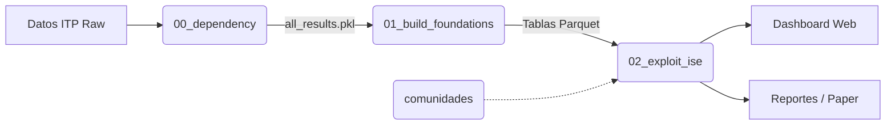

# Índice de Seguridad Económica
**Real Instituto Elcano**

Análisis de dependencias económicas en cadenas de suministro globales. Este proyecto desarrolla el **Indicador de Seguridad Comercial (ISC)**, que cuantifica la seguridad económica de los países midiendo dependencias directas e indirectas en el comercio bilateral por industria.

---

## 🎯 Objetivo

Desarrollar un índice que cuantifique la seguridad económica de los países, entendida como la capacidad de resistir disrupciones en sus cadenas de suministro, en un contexto de fragmentación geoeconómica.

---

## 🔬 Metodología y Flujo de Trabajo

El proyecto sigue un pipeline lineal dividido en tres fases críticas:

### 1️⃣ Fase de Cálculo (El Motor)
**Notebook:** `notebooks/analysis/00_dependency.ipynb`  
Es el núcleo técnico. Utiliza cálculo matricial masivo (potencialmente en GPU) para procesar la base de datos ITP (236 países, 170 industrias). Su función es calcular las **dependencias indirectas**: no solo quién vende a quién, sino quién es vulnerable a través de cadenas de intermediarios de hasta longitud 5.

### 2️⃣ Fase de Estructuración (El Arquitecto)
**Notebook:** `notebooks/analysis/01_build_foundations.ipynb`  
Toma los resultados masivos del motor y los organiza en "cimientos" utilizables. Genera archivos Parquet optimizados que consolidan la información en cuatro pilares:
- **Perfiles de País:** Vulnerabilidad y ranking global.
- **Hubs Globales:** Quiénes son los nodos clave que intermedian el comercio mundial.
- **Relaciones Críticas:** Vínculos bilaterales con alta dependencia y baja redundancia.
- **Caminos Significativos:** Las rutas reales que siguen los flujos comerciales.

### 3️⃣ Fase de Explotación (El Laboratorio)
**Notebook:** `notebooks/analysis/02_exploit_ise.ipynb`  
Es el punto de unión con la comunicación y el dashboard. Aquí se generan las visualizaciones estratégicas (heatmaps, scatter plots de riesgo) y se extraen los datos ligeros que alimentan el prototipo de visualización interactiva.

---

## 📁 Estructura del Proyecto

```
Seguridad-Economica/
├── data/
│   ├── raw/                        # Datos ITP originales (.csv.gz)
│   └── processed/                  # Datos procesados y consolidados
│       └── dependencias_consolidadas/  # Outputs de los notebooks 00 y 01
│
├── notebooks/                      # 📓 Notebooks de análisis (Ordenados por flujo)
│   ├── analysis/                   
│   │   ├── 00_dependency.ipynb         # ⚙️ MOTOR: Cálculo matricial de dependencias
│   │   ├── 01_build_foundations.ipynb  # 🧱 ARQUITECTO: Estructuración de tablas maestras
│   │   ├── 02_exploit_ise.ipynb        # 🧪 LABORATORIO: Análisis y visualizaciones
│   │   ├── comunidades.ipynb           # 🗺️ GEOPOLÍTICA: Clusters de riesgo y bloques
│   │   └── _archive/                   # Versiones anteriores (v1, v2, v3...)
│   │
│   ├── visualization/              # 📊 Generación de figuras para informes específicos
│   └── paper_ise/                  # 📝 Ejercicios específicos para el paper académico
│
├── dashboard_prototype/            # 🎨 Visualización interactiva (Web/HTML)
│   ├── index.html                      # Dashboard consolidado
│   ├── template.html                   # Plantilla de diseño
│   └── build.py                        # Script de compilación de datos
│
├── docs/                           # 📚 Metodología, briefs e informes
└── requirements.txt                # Dependencias Python
```

---

## 📊 Pipeline de Datos Visual



---

## 🛠️ Requisitos Técnicos

- **Python 3.10+**
- **Hardware:** Se recomienda GPU NVIDIA para el notebook `00_dependency` debido a la escala del cálculo matricial.
- **Librerías:** pandas, numpy, torch (para GPU), scipy, matplotlib, plotly.

---

## 👥 Equipo (Real Instituto Elcano)
- Manuel Alejandro Hidalgo
- Jorge Díaz Lanchas
- Miguel Otero

**Última actualización:** 24/02/2026
