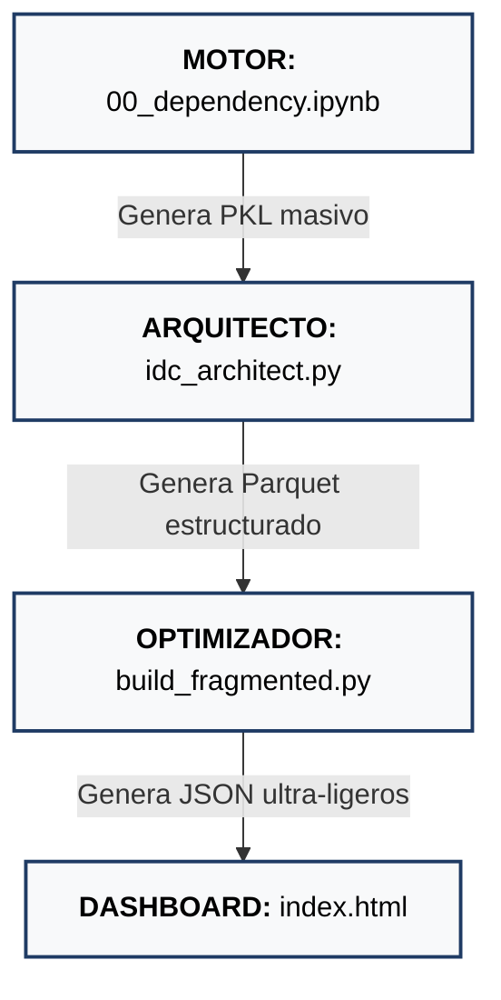

# 📊 IDC — indicador de dependencia comercial
**Real Instituto Elcano**  
> Última actualización: 03/03/2026 — *Versión Multi-año Unificada (V2.1 - Radar de Riesgo Oculto)*

Análisis de dependencias económicas en cadenas de suministro globales. El **IDC** cuantifica la vulnerabilidad de las economías midiendo dependencias directas e indirectas en el comercio bilateral por industria, en un contexto de fragmentación geoeconómica.

---

## 🧠 Metodología del indicador de dependencia comercial (IDC)

El **indicador de dependencia comercial (IDC)** es una métrica avanzada diseñada por el **Real Instituto Elcano** para identificar y cuantificar la vulnerabilidad de las naciones ante interrupciones en las cadenas globales de suministro. Supera la medición tradicional de "volumen de comercio" al enfocarse en la **estructura de dependencia** y la **capacidad de sustitución**.

### 1. El Concepto de Dependencia Multi-nivel

El factor diferencial de este proyecto es la distinción entre dos tipos de riesgos:

*   **Dependencia Directa:** Es el riesgo inmediato visible en las aduanas. Si el país A importa el 80% de sus semiconductores del país B, el país A tiene una alta dependencia directa de B.
*   **Dependencia Indirecta (Riesgo Oculto):** El modelo aplica algoritmos de análisis de grafos para rastrear toda la cadena de valor. Si el país B (proveedor directo) depende a su vez del país C para fabricar el semiconductor, el país A tiene una dependencia indirecta de C. El modelo detecta estos cuellos de botella geocéntricos que a menudo pasan desapercibidos en las estadísticas nacionales.

### 2. Cómo se calcula el IDC

El índice se construye siguiendo un proceso de tres etapas:

1.  **Cálculo de la Vulnerabilidad Industrial:** Para cada binomio industria-país, se calcula el peso de las importaciones sobre la producción total y se ajusta según la elasticidad de sustitución (cuán difícil es reemplazar ese insumo localmente o con otros proveedores).
2.  **Identificación de Hubs y Rutas:** Se utiliza el cálculo de centralidad de red para determinar qué países intermedian en más rutas críticas de suministro. Aquellos con un *Hub Score* elevado son puntos de control sistémico.
3.  **Agregación Nacional:** El IDC final de un país es la suma ponderada de las vulnerabilidades de todas sus industrias críticas, normalizada en un rango de 0 a 1 (donde 1 representa la máxima vulnerabilidad sistémica).

### 3. Jerarquía de Procesos y Flujo de Datos

El proyecto sigue una estructura de transformación en tres niveles, asegurando que los cálculos macroeconómicos complejos se conviertan en información visual fluida:

```mermaid
graph TD
    A[<b>MOTOR:</b> 00_dependency.ipynb] -->|Genera PKL masivo| B[<b>ARQUITECTO:</b> idc_architect.py]
    B -->|Genera Parquet estructurado| C[<b>OPTIMIZADOR:</b> build_fragmented.py]
    C -->|Genera JSON ultra-ligeros| D[<b>DASHBOARD:</b> index.html]
    
    style A fill:#f8f9fa,stroke:#1f3b64,stroke-width:2px,color:#000
    style B fill:#f8f9fa,stroke:#1f3b64,stroke-width:2px,color:#000
    style C fill:#f8f9fa,stroke:#1f3b64,stroke-width:2px,color:#000
    style D fill:#f8f9fa,stroke:#1f3b64,stroke-width:2px,color:#000
```

#### **Nivel 1: El Cerebro (Motor de Cálculo)**
*   **Script:** `notebooks/analysis/00_dependency.ipynb`
*   **Acción:** Abrir el Notebook y ejecutar todas las celdas. **Importante:** Cambiar la variable `anio` en la celda de configuración (celda 3) para procesar el año deseado (ej: 2015).
*   **Proceso Interno (Deep Dive):** 

    1. **Normalización ITP (Big Data Optimization)**: 
       - El motor procesa la base de datos *International Trade and Production Database* (ITPD-E). Debido a su tamaño masivo, utiliza **Dask** para la lectura paralela y filtrado de datos.
       - Aplica una optimización de memoria extrema mediante el uso de `float32` para valores comerciales y **definición de categorías** para códigos de país, permitiendo procesar años completos en máquinas con RAM limitada.
       - Si se detecta una GPU compatible con **CUDA**, el motor activa aceleración por hardware para las operaciones matriciales más pesadas.

    2. **Matrices de Transición (T) por Industria y Año**: 
       - Transforma el comercio nominal (en $) en **probabilidades de suministro** para cada corte temporal. 
       - Se construye una matriz $T$ para cada industria donde cada celda $T[j,i]$ representa la cuota de mercado del **territorio económico** proveedor $j$ sobre el consumo total del importador $i$.
       - Esta normalización permite tratar la red global como un grafo de propagación de riesgos: "Si el territorio $j$ sufre una disrupción, el territorio $i$ tiene una probabilidad $X$ de verse afectado en esa industria específica".

    3. **Análisis de Caminos (PIVI Methodology - $L=1$ a $L=5$)**: 
       - Esta es la innovación central (Metodología PIVI). El motor no se detiene en la **dependencia directa ($L=1$)**.
       - Calcula mediante potencias de matrices y análisis de rutas las **dependencias indirectas**:
         - **L=2**: Riesgos vía un intermediario (A depende de B porque B usa componentes de C).
         - **L=3 a L=5**: Rastro de la cadena de valor hasta el origen primario.
       - El sistema aplica una "poda por umbral" (threshold pruning) para descartar millones de rutas insignificantes y concentrarse únicamente en los cuellos de botella que realmente amenazan la seguridad económica nacional.

    4. **Scores de Intermediación (Identificación de Países Pivote)**: 
       - Una vez mapeados todos los caminos críticos, el motor evalúa a los países como nodos de tránsito:
         - **Frecuencia de Intermediación**: Cuántas veces un país aparece como "paso obligado" para el suministro de otros.
         - **Fuerza de Intermediación**: La intensidad acumulada de la dependencia que fluye a través de ese país.
       - Esto genera el *Hub Score*, que permite identificar países que, sin ser necesariamente grandes productores, tienen una capacidad inmensa de disrupción global por su posición logística o de ensamblaje.

*   **Salidas:** 
    - `dependencias{año}_borrar.csv.gz`: Matrices de transición bruta. El sufijo `_borrar` indica que es un archivo intermedio/temporal; se puede eliminar tras ser procesado por el Nivel 2.
    - `intermediarios_globales_{año}.parquet`: Frecuencias de paso y fuerzas de ruta. Fundamental para detectar cuellos de botella mundiales.
    - `country_profiles_{año}.parquet`: Desglose de dependencia total vs. directa a nivel país-industria (antes de normalizaciones).
    - `relaciones_criticas_{año}.parquet`: Subconjunto filtrado de relaciones de alto riesgo con métricas de escasez de caminos alternativos.
    - `caminos_significativos_{año}.parquet`: El "esqueleto" de la red de comercio internacional; catálogo de los flujos de mayor impacto.
    - `all_results_{año}.pkl`: El **mapa genético completo** (~1.4GB). Diccionario Python que contiene matrices de adyacencia, colecciones de caminos y cálculos intermedios. Es el objeto de datos definitivo del proyecto.

#### **Nivel 2: El Arquitecto (Estructuración)**
*   **Script:** `notebooks/analysis/idc_architect.py`
*   **Acción:** Ejecutar en terminal: `py notebooks/analysis/idc_architect.py [AÑO]` (ej: `py notebooks/analysis/idc_architect.py 2015`).
*   **Proceso Interno:**
    1. Filtra y destila el `.pkl` masivo.
    2. Calcula los **Scores de Hubs** (centralidad) y rankings globales.
    3. Identifica **Relaciones Críticas** (aquellas con alta dependencia y pocos proveedores alternativos).
*   **Salidas (`data/processed/historico/`):** Archivos `.parquet` optimizados que constituyen la base de datos "limpia" para investigación.
    - `profiles_{año}`: KPIs agregados por país (ISE, Ranking, importancia estratégica, diversificación de proveedores).
    - `explorer_{año}`: El núcleo de la red. Cruce país-país-industria con desglose de dependencias directas/indirectas y rutas de intermediación.
    - `hubs_{año}`: Métricas de centralidad global para cada país actuando como nodo de tránsito.
    - `bilateral_{año}`: Matriz de relaciones estratégicas enfocada en la "Criticidad" y dificultad de sustitución.
    - `dependencies_{año}`: Rankings granulares de las industrias que generan mayor riesgo para cada economía.
    - `critical_{año}`: Monitor global de riesgos extremos (vulnerabilidades > 70%).

#### **Nivel 3: El Puente (Optimización Web)**
*   **Script:** `dashboard_prototype/build_fragmented.py`
*   **Acción:** Ejecutar en terminal: `py dashboard_prototype/build_fragmented.py`.
*   **Proceso Interno:**
    1. Detecta automáticamente los años procesados en el nivel anterior.
    2. Aplica **filtros de relevancia** (enfocado en España y riesgos sistémicos > 10%).
    3. Transforma tablas a **formato de matriz comprimida** (`c:` columnas, `d:` datos) para reducir el peso de descarga.
    4. Genera el archivo `dashboard_elcano.html` inyectando el logo y configurando el modo multi-año.
*   **Salidas (`dashboard_prototype/data_dist/`):** Archivos JSON optimizados para consumo en aplicaciones web.
    - `meta.json`: Metadatos globales (años disponibles, nombres de industrias, series de evolución global).
    - `history.json`: Series temporales pre-calculadas de riesgo sectorial para todos los países.
    - `year_XXXX.json`: Fragmentos anuales "lazy-load" que contienen perfiles, hubs y una versión indexada del explorador para búsquedas instantáneas O(1).
    - `index.html`: Dashboard unificado y listo para despliegue.

---

---

## 🏗️ Arquitectura de Visualización Web

Para garantizar una experiencia de usuario fluida con gigabytes de datos históricos, el sistema utiliza una arquitectura de **Carga Diferida Estática**.

### 1. El Optimizador (`build_fragmented.py`)
Este script transforma los datos masivos de investigación en un formato optimizado para la web:
- **Indexación O(1):** Pre-calcula y agrupa las rutas comerciales por importador e industria. Esto elimina la necesidad de que el navegador realice búsquedas pesadas, permitiendo respuestas instantáneas en el "Industria Explorer".
- **Fragmentación Temporal:** Divide los datos en archivos `year_XXXX.json`. El navegador solo descarga los datos del año que el usuario está visualizando, reduciendo el consumo de memoria inicial de +300MB a ~12MB.
- **Compresión de Matriz:** Transforma las tablas en un formato compacto (`c:` para nombres de columna, `d:` para datos por filas) para minimizar el tráfico de red.

### 2. El Dashboard (`dashboard_prototype/template.html`)
El frontend es una **Single Page Application (SPA)** de alto rendimiento que:
- **Carga Bajo Demanda:** Gestiona la descarga asíncrona de piezas de datos según la navegación del usuario.
- **Motor Visual Plotly.js:** Renderiza mapas interactivos 3D, diagramas de radar de riesgo y treemaps sectoriales.
- **Sincronización de Estado:** Un cambio en el selector de año actualiza automáticamente todos los componentes (KPIs, Mapas y Rankings) de forma atómica.

---

## 🏢 Guía de Handover para Implementación Profesional

Esta sección es crítica para la empresa encargada de la web definitiva. El objetivo es escalar el prototipo actual a una plataforma robusta.

### 📦 El "Contrato" de Datos (Arquitectura Fragmentada)
El sistema actual utiliza una carga diferida (*lazy loading*) para manejar el volumen masivo de datos sin saturar el navegador. El generador `build_fragmented.py` establece el estándar que el backend definitivo debe seguir:

1. **Punto de Entrada (`meta.json`)**: Contiene los datos transversales necesarios para inicializar la interfaz.
   - `available_years`: Lista de periodos disponibles en el sistema.
   - `evolution`: Series históricas de KPIs (vulnerabilidad, rango, importancia).
   - `industries`: Diccionario maestro de sectores (`id`, `nombre`).
   - `critical_evolution`: Conteo anual de alertas de seguridad.

2. **Datos bajo demanda (`year_XXXX.json`)**: Archivos específicos por año que se cargan solo cuando el usuario los solicita.
   - `profiles`: Métricas detalladas por país (ISO3).
   - `hubs`: Rankings de centralidad y scores de intermediación.
   - `explorer_indexed`: (Crítico) Mapa pre-calculado de rutas comerciales indexado por `[importador][industria]` para permitir consultas en tiempo constante O(1).
   - `bilateral`: Listado de dependencias que superan los umbrales de riesgo.

### 🚀 Hoja de Ruta de Escalabilidad
1.  **Backend Analítico:** Abandonar los archivos `.json` estáticos en favor de una base de datos.
2.  **Tecnología Recomendada:** Utilizar **DuckDB** o **ClickHouse** en el servidor. Estas tecnologías permiten realizar consultas analíticas complejas directamente sobre los archivos `.parquet` generados por el "Arquitecto" en milisegundos.
3.  **Migración a Framework Pro:** Se recomienda portar la lógica del dashboard (actualmente en JS nativo) a **Next.js** o **Nuxt** para mejorar la gestión de estados globales y la escalabilidad del frontend.
4.  **Visualización de Alto Rendimiento:** Si el número de flujos comerciales a visualizar simultáneamente crece, considerar sustituir Plotly por **Deck.gl** o **Mapbox GL**, aprovechando la aceleración por hardware del cliente.

---

## 🛠️ Requisitos Técnicos

-   **Python 3.10+ (usar `py` en Windows)**
-   **Lanzar Dashboard Local:** `py -m http.server 8000` (desde `dashboard_prototype`)
-   **GPU NVIDIA:** Altamente recomendada para el motor de cálculo (`00_dependency.ipynb`).
-   **Dependencias Core:** pandas, numpy, torch, plotly, pyarrow (para manejo de Parquet).

---

## 👥 Equipo (Real Instituto Elcano)
-   Manuel Alejandro Hidalgo
-   Miguel Otero

---
*Este proyecto es propiedad del Real Instituto Elcano. El código y los datos generados son para fines de análisis estratégico de seguridad económica.*
