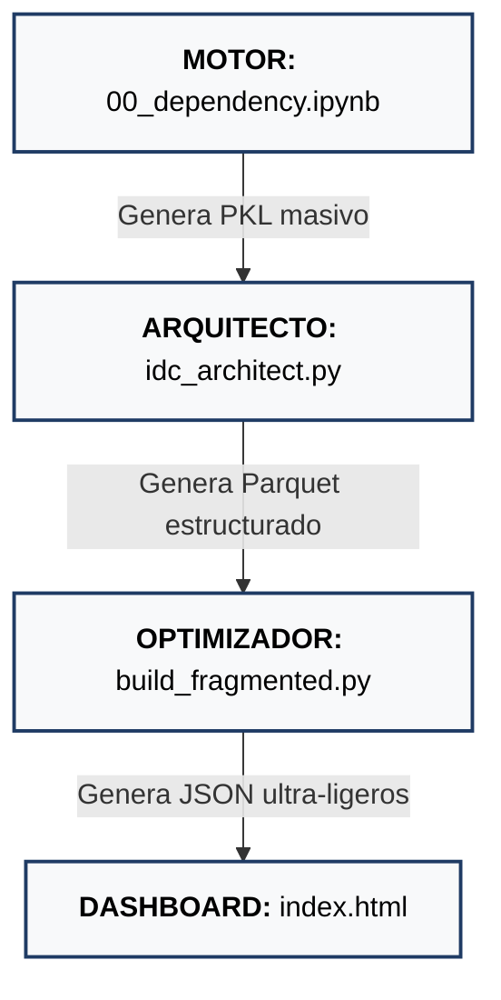
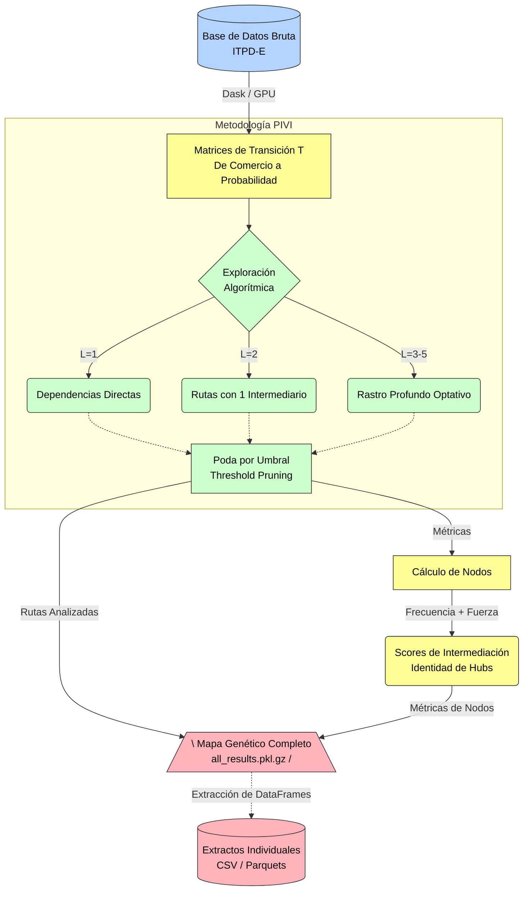
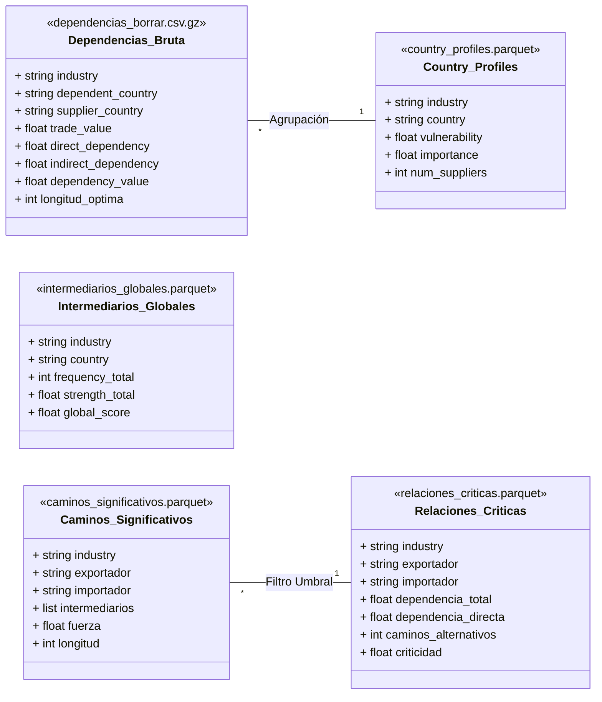
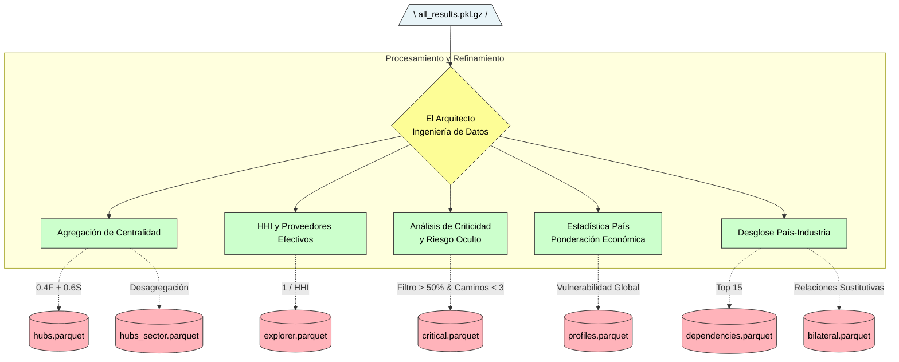
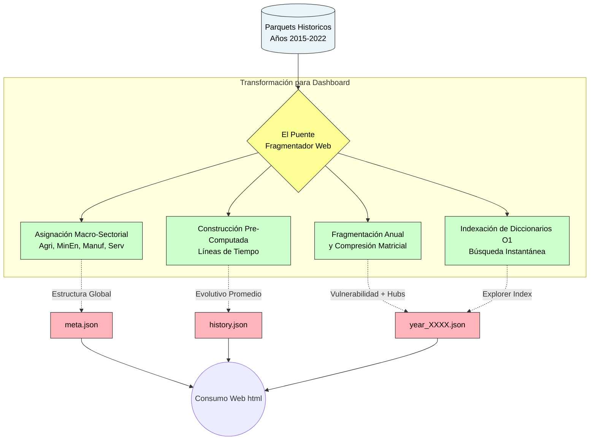
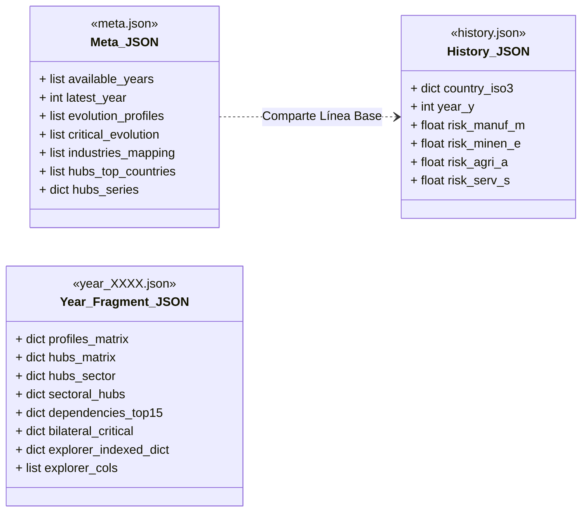

# 📊 IDEE — Índice de Dependencia Económica Elcano
**Real Instituto Elcano**  
> Última actualización: 03/03/2026 — *Versión Multi-año Unificada (V2.1 - Radar de Riesgo Oculto)*

Análisis de dependencias económicas en cadenas de suministro globales. El **IDEE** cuantifica la vulnerabilidad de las economías midiendo dependencias directas e indirectas en el comercio bilateral por industria, en un contexto de fragmentación geoeconómica.

---

## 🧠 Metodología del Índice de Dependencia Económica Elcano (IDEE)

El **Índice de Dependencia Económica Elcano (IDEE)** es una métrica avanzada diseñada por el **Real Instituto Elcano** para evaluar la posición de fortaleza o vulnerabilidad de un país en el contexto del comercio internacional de una mercancía, bien o servicio específico a nivel internacional.

En un mercado global interconectado, las adquisiciones de un país consumidor final de un bien no implican que este dependa de todos los países, pero sí de un entramado de relaciones de intermediación comercial. Aunque un importador no adquiera un bien directamente de un determinado productor, está insertado en una red sectorial de reexportación. Por tanto, una disrupción en cualquier eslabón de este entramado comercial puede llegar a afectarle no solo de forma directa, sino también indirecta. El IDEE supera la miopía de las estadísticas bilaterales tradicionales, cuantificando cómo el riesgo se propaga a través de la red de suministro de cada sector.

### 🔍 Guía Conceptual y Justificación Metodológica: ¿Por qué el índice puede superar 1?

Para un economista formado pero no especialista en teoría de redes, que el indicador de Dependencia Total ($DT$) supere el valor de 1 (100%) puede parecer contraintuitivo a primera vista. Sin embargo, no se trata de un error ni de un problema de doble conteo, sino de una propiedad matemática y económica esencial estructurada en cinco argumentos:

1. **El supuesto de proporcionalidad (mixing)**: El modelo asume que las exportaciones de un país intermediario (por ejemplo, Países Bajos) se extraen proporcionalmente de su volumen de suministro disponible (producción propia + importaciones de todos sus orígenes). Bajo este supuesto (que es un estándar de la OCDE y la OMC en sus bases de datos de valor añadido TiVA), el producto de dependencias en cadena $T_{ik} \cdot T_{kj}$ no es una conjetura, sino la **fracción esperada del suministro de $j$ procedente del intermediario $k$ que se origina en última instancia en $i$**.
2. **Atenuación automática por producción interna**: El denominador de la matriz de transición, $S_b = \text{importaciones} + \text{producción doméstica}$, corrige cualquier riesgo de sobribución. Si el país intermediario tiene una gran producción propia, su coeficiente de dependencia respecto a los insumos externos se reduce drásticamente, amortiguando los caminos indirectos.
   * *Ejemplo:* En la ruta **Vietnam $\xrightarrow{\text{flores}}$ Países Bajos $\xrightarrow{\text{flores}}$ España**, si España compra el 50% de sus flores a Países Bajos, pero Países Bajos solo importa el 10% de su suministro de flores desde Vietnam (porque el 90% restante es producción local neerlandesa o de otros socios), la dependencia indirecta de España respecto a Vietnam a través de esta ruta es de solo $0.5 \times 0.1 = 0.05$ (un 5%).
3. **La analogía con la Inversa de Leontief**: La suma de todas las fuerzas de caminos de todas las longitudes es formalmente equivalente al desarrollo de la serie de Neumann $\sum_{\ell=1}^{\infty} \mathbf{T}^{\ell} = (\mathbf{I} - \mathbf{T})^{-1} - \mathbf{I}$, que es el análogo exacto intra-sectorial (a nivel de países) de la clásica inversa de Leontief. El IDEE es una versión **truncada en $L_{\max}$** de esta serie (típicamente 3 o 5 pasos). Como cada país con producción nacional positiva tiene una suma de columnas en $\mathbf{T}$ estrictamente menor que 1, la producción local actúa como una "fuga" o sumidero de riesgo, garantizando la convergencia del índice.
   * *Nota al pie matemática:* En los casos excepcionales donde un país registre una producción doméstica nula ($Y_b = 0$) en un determinado sector, la columna de la matriz sumará exactamente 1. Esto ralentiza la velocidad de convergencia local de la serie, pero la red global converge gracias al resto de países con producción positiva.
4. **$DT > 1$ es información de redundancia y vulnerabilidad**: El IDEE no es una cuota de mercado ni una probabilidad, sino una **métrica de exposición**. Si existen múltiples rutas paralelas e independientes que conducen al mismo origen, tu vulnerabilidad ante una disrupción en ese origen es sumamente alta porque todas las rutas colapsarán a la vez.
   * *Ejemplo:* Si importas el mismo producto de tres intermediarios distintos (Alemania, Francia e Italia), un índice clásico de concentración como el HHI te diría que estás muy diversificado y seguro. Sin embargo, si los tres intermediarios dependen en un 90% de China, el IDEE sumará la exposición de los tres caminos hacia China, arrojando un índice acumulativo muy superior a 1. Esto desvela que tu diversificación directa es una ilusión.
5. **Variante normalizada como control de robustez**: Para comparaciones estadísticas donde se requiera que las dependencias sumen exactamente 1 (100%) por importador-sector, se puede utilizar la variante normalizada $DT_{ij} / \sum_k DT_{kj}$. No obstante, el IDEE mantiene la versión acumulativa sin normalizar como métrica principal porque es la única que preserva la información real de redundancia y cuellos de botella.

---

### 📦 Recuadro didáctico: Qué mide y qué no mide el IDEE (Para economistas con prisa)

* **Red comercial, no trazabilidad física**: El IDEE mide la vulnerabilidad a través de flujos comerciales sectoriales brutos. No rastrea físicamente si una flor concreta proviene de Vietnam, sino la dependencia financiera y de suministro: si el intermediario (Países Bajos) sufre un corte de su proveedor, su capacidad de suministrarnos a nosotros en el mismo sector se reducirá proporcionalmente.
* **El supuesto de proporcionalidad (mixing)**: Asume que las exportaciones de un país combinan proporcionalmente lo que produce internamente y lo que importa en ese sector específico ($T_{ab} = x_{ab} / S_b$).
* **Lectura de valores superiores a 1**: Indica que la exposición real del país está multiplicada por la existencia de varias rutas de intermediación que dependen del mismo origen común. Indica concentración de riesgo en el entramado global.
* **Diferencia con el HHI**: El **HHI** mide la concentración de proveedores directos en aduana, asumiendo ciegamente que comprar a tres países diferentes es diversificar, sin ver si todos ellos le compran al mismo origen. El IDEE desvela esta ilusión.
* **Diferencia con TiVA**: El indicador **TiVA** de la OCDE mide el valor añadido neto contenido en el comercio cruzando múltiples sectores, mientras que el **IDEE** mide la vulnerabilidad bruta de suministro y reexportación dentro del mismo sector.

### 1. El Concepto de Dependencia Multi-nivel

El factor diferencial de este proyecto es la distinción entre dos tipos de riesgos:

*   **Dependencia Directa:** Es el riesgo inmediato visible en las aduanas. Si el país A importa el 80% de sus semiconductores del país B, el país A tiene una alta dependencia directa de B.
*   **Dependencia Indirecta (Riesgo Oculto):** El modelo aplica algoritmos de análisis de grafos para rastrear toda la cadena de suministro sectorial. Si el país B (proveedor directo) depende a su vez del país C para el suministro de ese mismo bien (reexportación o intermediación comercial), el país A tiene una dependencia indirecta de C. El modelo detecta estos cuellos de botella geocéntricos que a menudo pasan desapercibidos en las estadísticas nacionales.

### 2. Cómo se calcula el IDEE

El índice se construye siguiendo un proceso de tres etapas:

1.  **Cálculo de la Vulnerabilidad Industrial:** Para cada binomio industria-país, se calcula el peso de las importaciones sobre la producción total y se ajusta según la elasticidad de sustitución (cuán difícil es reemplazar ese insumo localmente o con otros proveedores).
2.  **Identificación de Hubs y Rutas:** Se utiliza el cálculo de centralidad de red para determinar qué países intermedian en más rutas críticas de suministro. Aquellos con un *Hub Score* elevado son puntos de control sistémico.
3.  **Agregación Nacional:** El IDEE final de un país es la suma ponderada de las vulnerabilidades de todas sus industrias críticas, normalizada en un rango de 0 a 1 (donde 1 representa la máxima vulnerabilidad sistémica).

### 3. Jerarquía de Procesos y Flujo de Datos

El proyecto sigue una estructura de transformación en tres niveles, asegurando que los cálculos macroeconómicos complejos se conviertan en información visual fluida:

```mermaid
graph TD
    A[<b>MOTOR:</b> 00_dependency.ipynb] -->|Genera PKL masivo| B[<b>ARQUITECTO:</b> idc_architect.py]
    B -->|Genera Parquet estructurado| C[<b>OPTIMIZADOR:</b> build_fragmented.py]
    C -->|Genera JSON ultra-ligeros| D[<b>DASHBOARD:</b> index.html]
    
    style A fill:#f8f9fa,stroke:#1f3b64,stroke-width:2px,color:#000
    style B fill:#f8f9fa,stroke:#1f3b64,stroke-width:2px,color:#000
    style C fill:#f8f9fa,stroke:#1f3b64,stroke-width:2px,color:#000
    style D fill:#f8f9fa,stroke:#1f3b64,stroke-width:2px,color:#000
```

> [!NOTE]
> **Paso 0: Preparación de Datos (Herramienta Auxiliar no Web)**
> El script `notebooks/00_data_processing.ipynb` **no forma parte de este pipeline de producción**. Es una herramienta auxiliar para Data Science e investigación que consolida los archivos `.csv.gz` brutos (2001-2022) en un único archivo global `dependencies_full.parquet`. Su propósito es facilitar el análisis exploratorio ad-hoc y reducir drásticamente el peso en RAM al realizar consultas con Pandas.

#### **Nivel 1: El Cerebro (Motor de Cálculo)**
*   **Script:** `notebooks/analysis/00_dependency.ipynb`
*   **Acción:** Abrir el Notebook y ejecutar todas las celdas. **Importante:** Cambiar la variable `anio` en la celda de configuración (celda 3) para procesar el año deseado (ej: 2015).
*   **Proceso Interno (Deep Dive):** 

    1. **Normalización ITP (Big Data Optimization)**: 
       - El motor procesa la base de datos *International Trade and Production Database* (ITPD-E). Debido a su tamaño masivo, utiliza **Dask** para la lectura paralela y filtrado de datos.
       - Aplica una optimización de memoria extrema mediante el uso de `float32` para valores comerciales y **definición de categorías** para códigos de país, permitiendo procesar años completos en máquinas con RAM limitada.
       - Si se detecta una GPU compatible con **CUDA**, el motor activa aceleración por hardware para las operaciones matriciales más pesadas.

    2. **Matrices de Transición (T) por Industria y Año**: 
       - Transforma el comercio nominal (en $) en **probabilidades de suministro** para cada corte temporal. 
       - Se construye una matriz $T$ para cada industria donde cada celda $T[j,i]$ representa la cuota de mercado del **territorio económico** proveedor $j$ sobre el consumo total del importador $i$.
       - Esta normalización permite tratar la red global como un grafo de propagación de riesgos: "Si el territorio $j$ sufre una disrupción, el territorio $i$ tiene una probabilidad $X$ de verse afectado en esa industria específica".

    3. **Análisis de Caminos (PIVI Methodology - $L=1$ a $L=3/5$)**:
       *Nota conceptual fundamental:* El análisis es de carácter estrictamente intra-sectorial (propagación comercial de un mismo producto o grupo de productos a través de países comercializadores o refinadores del mismo sector). No debe confundirse con cadenas de valor intersectoriales (Input-Output). Como el modelo suma la intensidad de múltiples caminos independientes de intermediación paralelos de un mismo producto, la Dependencia Total acumulada (el PIVI Score o IDEE) puede ser superior a 1 (100%). 
       - Esta es la innovación central (Metodología PIVI). El motor no se detiene en la **dependencia directa ($L=1$)**.
       - Mediante **algoritmos de exploración y enumeración de rutas**, calcula las dependencias indirectas:
         - **L=2**: Riesgos vía un intermediario (A depende de B porque B reexporta o comercializa productos de C dentro del mismo sector).
         - **L=3 (Estándar)**: Captura la gran mayoría de las dependencias indirectas sistémicas.
         - **L=4 a L=5 (Opcional)**: Rastro profundo reservado para industrias con cadenas de suministro sectoriales hiper-fragmentadas.
       - El sistema aplica una **poda por umbral (threshold pruning)** durante la exploración para descartar millones de rutas insignificantes y concentrarse únicamente en los cuellos de botella reales.

    4. **Scores de Intermediación (Identificación de Países Pivote)**: 
       - Una vez mapeados los caminos críticos, el motor evalúa a cada territorio como un nodo de tránsito sistémico mediante dos métricas clave:
         - **Frecuencia de Intermediación ($F$):** Conteo bruto de cuántas rutas críticas pasan por el territorio $k$. Indica su "omnipresencia" en las cadenas globales.
         - **Fuerza de Intermediación ($S$):** Suma ponderada de la intensidad de los caminos, donde el impacto se ajusta según la posición: $S_k = \sum_{p \in Caminos} \frac{Fuerza(p)}{Posición(k)}$.
       - **Cálculo del Hub Score:** El motor combina ambas métricas en un índice final: 
         $$\text{Hub Score} = 0.4 \cdot F_{\text{norm}} + 0.6 \cdot S_{\text{norm}}$$
       - **Ejemplo Práctico:** Un territorio como **Singapur** o **Países Bajos** puede tener una producción propia limitada en ciertos sectores, pero si el 60% de los componentes críticos de una industria fluyen a través de ellos hacia el resto del mundo, su *Hub Score* superará al de los grandes productores primarios. Esto los identifica como "puntos de estrangulamiento" (choke-points) del sistema.

*   **Salidas:** 
    - `dependencias{año}_borrar.csv.gz`: Matrices de transición bruta. El sufijo `_borrar` indica que es un archivo intermedio/temporal; se puede eliminar tras ser procesado por el Nivel 2.
    - `intermediarios_globales_{año}.parquet`: Frecuencias de paso y fuerzas de ruta. Fundamental para detectar cuellos de botella mundiales.
    - `country_profiles_{año}.parquet`: Desglose de dependencia total vs. directa a nivel país-industria (antes de normalizaciones).
    - `relaciones_criticas_{año}.parquet`: Subconjunto filtrado de relaciones de alto riesgo con métricas de escasez de caminos alternativos.
    - `caminos_significativos_{año}.parquet`: El "esqueleto" de la red de comercio internacional; catálogo de los flujos de mayor impacto.
    - `all_results_{año}.pkl.gz`: El **mapa genético completo** (~200MB comprimido nativamente). Diccionario Python que contiene matrices de adyacencia, colecciones de caminos y cálculos intermedios. Es el objeto de datos definitivo del proyecto.

**Flujo de Datos (Nivel 1):**

```mermaid
graph TD
    classDef db fill:#b3d4ff,stroke:#333,stroke-width:1px,color:#000
    classDef proc fill:#fdfd96,stroke:#333,stroke-width:1px,color:#000
    classDef pivi fill:#ccffcc,stroke:#333,stroke-width:1px,color:#000
    classDef out fill:#ffb3ba,stroke:#333,stroke-width:1px,color:#000

    A[(Base de Datos Bruta<br/>ITPD-E)]:::db -->|Dask / GPU| B[Matrices de Transición T<br/>De Comercio a Probabilidad]:::proc
    
    subgraph Metodología PIVI
        B --> C{Exploración<br/>Algorítmica}:::pivi
        C -->|L=1| D(Dependencias Directas):::pivi
        C -->|L=2| E(Rutas con 1 Intermediario):::pivi
        C -->|L=3-5| F(Rastro Profundo Optativo):::pivi
        
        D -.-> G[Poda por Umbral<br>Threshold Pruning]:::pivi
        E -.-> G
        F -.-> G
    end

    G -->|Métricas| H[Cálculo de Nodos]:::proc
    H -->|Frecuencia + Fuerza| I(Scores de Intermediación<br/>Identidad de Hubs):::proc
    
    G -->|Rutas Analizadas| K[/\ Mapa Genético Completo<br/>all_results.pkl.gz /\]:::out
    I -->|Métricas de Nodos| K
    
    K -.->|Extracción de DataFrames| J[(Extractos Individuales<br/>CSV / Parquets)]:::out
```

**Esquema de Datos (Estructura de Ficheros Extraídos):**

```mermaid
classDiagram
    direction LR
    
    class Dependencias_Bruta {
        <<dependencias_borrar.csv.gz>>
        + string industry
        + string dependent_country
        + string supplier_country
        + float trade_value
        + float direct_dependency
        + float indirect_dependency
        + float dependency_value
        + int longitud_optima
    }

    class Intermediarios_Globales {
        <<intermediarios_globales.parquet>>
        + string industry
        + string country
        + int frequency_total
        + float strength_total
        + float global_score
    }
    
    class Caminos_Significativos {
        <<caminos_significativos.parquet>>
        + string industry
        + string exportador
        + string importador
        + list intermediarios
        + float fuerza
        + int longitud
    }

    class Relaciones_Criticas {
        <<relaciones_criticas.parquet>>
        + string industry
        + string exportador
        + string importador
        + float dependencia_total
        + float dependencia_directa
        + int caminos_alternativos
        + float criticidad
    }

    class Country_Profiles {
        <<country_profiles.parquet>>
        + string industry
        + string country
        + float vulnerability
        + float importance
        + int num_suppliers
    }
    
    Dependencias_Bruta "*" -- "1" Country_Profiles : Agrupación
    Caminos_Significativos "*" -- "1" Relaciones_Criticas : Filtro Umbral
```

#### **Nivel 2: El Arquitecto (Estructuración y Refinamiento Analytics)**

*   **Script:** `notebooks/analysis/idc_architect.py`
*   **Acción:** Ejecutar en terminal: `py notebooks/analysis/idc_architect.py [AÑO]` (ej: `py notebooks/analysis/idc_architect.py 2015` o `py notebooks/analysis/idc_architect.py 2015 2016 2017`).
*   **Proceso Interno (Ingeniería de Datos):**
    El Nivel 1 genera un archivo inmenso y complejo (`.pkl`). El "Arquitecto" actúa como una fase de destilación de datos (*Data Distillation*), procesando ese diccionario profundo para construir tablas analíticas (*Tidy Data*) listas para el consumo estadístico y visual:

    1. **Agregación de Centralidad (Global Hubs):** 
       - Suma la frecuencia y la fuerza de intermediación de cada país a través de *todas* las industrias.
       - Aplica una doble normalización comparando contra los valores máximos mundiales.
       - Calcula el Score Global (Hub) combinado $0.4F + 0.6S$ y asigna un ranking (`global_rank`) anual de posición geoestratégica.
    
    2. **Concentración de Mercado y HHI (Herfindahl-Hirschman Index):** 
       - Por cada país e industria, evalúa el nivel de monopolio en sus importaciones.
       - Expresa esta concentración mediante el **HHI** (suma de las cuotas de mercado al cuadrado de todos sus proveedores). 
       - Transforma el HHI en un KPI mucho más intuitivo comercialmente: **Proveedores Efectivos** ($\frac{1}{HHI}$). Ejemplo: Si España le compra de 50 países, pero uno solo tiene el 95% de la cuota, sus "proveedores efectivos" caerán drásticamente a un valor cercano a 1.
    
    3. **Disección del "Riesgo Oculto" (Hidden Risk) y Criticidad:**
       - Filtra todas aquellas dependencias que por sí solas superen el **50% del total**.
       - Separa qué proporción de ese riesgo global es directo (comercio nominal) y qué proporción es *riesgo indirecto oculto* a través de terceros.
       - Calcula una penalización de la métrica por redundancia (*Criticidad*): si la herramienta PIVI del Nivel 1 no encontró al menos 3 rutas alternativas fuertes para esa dependencia, se clasifica como una vulnerabilidad máxima.

    4. **Agregación Macro-Estadística (Perfiles de País):**
       - Construye el Índice de Vulnerabilidad Nacional promediando el riesgo de todas las industrias, ponderando cuidadosamente por el **peso económico (valor en dólares)** de la industria. Así, la falta de tornillos genéricos pondera mucho menos que la de litio o semiconductores.
       - En dirección opuesta, computa el Índice de **Importancia Sistémica**, representando cuán indispensable es un país para las importaciones globales.

*   **Salidas (`data/processed/historico/`):** Todos los archivos se guardan en `.parquet` altamente eficientes. Son la base de datos "limpia" oficial para cualquier tarea *Data Science* posterior.
    - `profiles_{año}.parquet`: Tarjeta de perfil por país. Incluye Vulnerabilidad general ponderada, cuota de riesgo indirecto y promedio de proveedores efectivos.
    - `explorer_{año}.parquet`: El núcleo exploratorio bilateral. Desglose detallado país-país-industria, incluyendo los HHI sectoriales y el nombre de la ruta principal de intermediación (`top_intermediary`).
    - `hubs_{año}.parquet`: Identidad métrica completa de los nodos sistémicos y ranking logístico.
    - `hubs_sector_{año}.parquet`: Identidad métrica de los hubs (capacidad de intermediación) desagregada por industria/sector y año.
    - `bilateral_{año}.parquet`: Monitor de criticidad pura entre pares (exportador-importador-industria).
    - `dependencies_{año}.parquet`: Las 15 vulnerabilidades más altas (`Top 15`) de cada país. Útil para mapas de calor sectoriales rápidos.
    - `critical_{año}.parquet`: Tabla con el cálculo explícito del "Hidden Risk Factor" (porcentaje de riesgo que es invisible).

**Flujo de Destilación (Nivel 2):**

```mermaid
graph TD
    classDef in fill:#e8f4f8,stroke:#333,stroke-width:1px,color:#000
    classDef proc fill:#fdfd96,stroke:#333,stroke-width:1px,color:#000
    classDef func fill:#ccffcc,stroke:#333,stroke-width:1px,color:#000
    classDef out fill:#ffb3ba,stroke:#333,stroke-width:1px,color:#000

    A[/\ all_results.pkl.gz /\]:::in --> B{El Arquitecto<br/>Ingeniería de Datos}:::proc
    
    subgraph Procesamiento y Refinamiento
        B --> C[Agregación de Centralidad]:::func
        B --> D[HHI y Proveedores Efectivos]:::func
        B --> E[Análisis de Criticidad<br/>y Riesgo Oculto]:::func
        B --> F[Estadística País<br/>Ponderación Económica]:::func
        B --> J[Desglose País-Industria]:::func
    end

    C -.->|0.4F + 0.6S| G[(hubs.parquet)]:::out
    C -.->|Desagregación| G2[(hubs_sector.parquet)]:::out
    E -.->|Filtro > 50% & Caminos < 3| H[(critical.parquet)]:::out
    D -.->|1 / HHI| I[(explorer.parquet)]:::out
    
    J -.->|Top 15| K[(dependencies.parquet)]:::out
    J -.->|Relaciones Sustitutivas| L[(bilateral.parquet)]:::out
    
    F -.->|Vulnerabilidad Global| M[(profiles.parquet)]:::out
```

**Esquema de Datos (Estructura Analítica *Tidy Data*):**

```mermaid
classDiagram
    direction LR

    class Profiles {
        <<profiles.parquet>>
        + string country
        + float vulnerability
        + float indirect_share
        + float num_suppliers_effective
        + float importance
        + int global_rank
        + int year
    }

    class Explorer {
        <<explorer.parquet>>
        + string importer
        + string exporter
        + string industry
        + float dep_total
        + float dep_direct
        + float dep_indirect
        + string top_intermediary
        + float path_strength
        + float hhi_sector
        + float eff_suppliers_sector
    }

    class Hubs {
        <<hubs.parquet>>
        + string country
        + int frequency_total
        + float strength_total
        + float freq_norm
        + float strength_norm
        + float global_score
        + int global_rank
        + int year
    }
    
    class Hubs_Sector {
        <<hubs_sector.parquet>>
        + int year
        + string country
        + string industry
        + int frequency
        + float strength
        + float freq_norm
        + float strength_norm
        + float hub_score
        + int hub_rank
    }

    class Critical {
        <<critical.parquet>>
        + string exportador
        + string importador
        + string industry
        + float dependencia_total
        + float dependencia_directa
        + float dependencia_indirecta
        + float hidden_risk_factor
        + float hidden_risk_abs
        + int caminos_alternativos
        + float criticidad
        + int year
    }

    class Dependencies {
        <<dependencies.parquet>>
        + string dependent_country
        + string industry
        + float dependency_value
    }

    class Bilateral {
        <<bilateral.parquet>>
        + string importer
        + string exporter
        + string industry
        + float criticidad
        + float dependency
    }
```

#### **Nivel 3: El Puente (Optimización Web y Despliegue)**
*   **Script:** `dashboard_prototype/build_fragmented.py`
*   **Acción:** Ejecutar en terminal: `py dashboard_prototype/build_fragmented.py`.
*   **Proceso Interno (Compresión y Estructuración de API Local):**
    Los archivos Parquet son inmanejables para un navegador web de forma nativa. El Nivel 3 actúa como un motor de compresión y empaquetado, generando archivos `.json` ultraligeros y fragmentados (*lazy-load*) para el visualizador HTML:

    1. **Agrupación Macro-Sectorial Geopolítica:** Escanea la descripción de las cientos de industrias microscópicas (ej. "wheat", "coal", "transport") y las mapea en 4 grandes macros artificiales: Agricultura (`Agri`), Minerales/Energía (`MinEn`), Manufactura (`Manuf`) y Servicios (`Serv`).
    2. **Cálculo de Intensidad y Evolución Histórica:** Ensambla la línea de tiempo de todos los componentes cruzando los años disponibles para generar gráficos continuos de *Vulnerabilidad vs. Importancia* sin requerir cómputos del lado del cliente.
    3. **Compresión Matricial:** Abandona el esquema tradicional de JSON de Lista-de-Objetos `[{col1: val1, col2: val2}]` por un formato de Matriz Comprimida `{c: [columnas], d: [[val1, val2]]}`, reduciendo el peso de las descargas en un 60-70%.
    4. **Indexación para Búsquedas O(1):** El gigantesco Parquet `explorer` es pre-filtrado e indexado en un diccionario multinivel (`{importador: {industria: [datos]}}`) para que las búsquedas en la web carguen de forma instantánea.

*   **Salidas (`dashboard_prototype/data_dist/`):** Base de datos web descentralizada para *frontend*.
    - `meta.json`: Metadatos estáticos (nombres de países, catálogo de industrias, series de evolución rápida de indicadores por defecto).
    - `history.json`: Histórico de "intensidad" temporal del riesgo segregado por los 4 Macro-Sectores para cada país.
    - `year_XXXX.json`: Los fragmentos pesados (*Lazy-Load* anual). Contienen el núcleo de perfiles, relaciones bilaterales, dependencias extremas e índice de hubs del año específico.
    - `index.html`: La *Single Page Application* con el logo Elcano en Base64 inyectado y preparada para consumir la carpeta `data_dist`.

**Flujo y Estructura (Nivel 3):**

```mermaid
graph TD
    classDef in fill:#e8f4f8,stroke:#333,stroke-width:1px,color:#000
    classDef proc fill:#fdfd96,stroke:#333,stroke-width:1px,color:#000
    classDef func fill:#ccffcc,stroke:#333,stroke-width:1px,color:#000
    classDef out fill:#ffb3ba,stroke:#333,stroke-width:1px,color:#000

    A[(Parquets Historicos<br/>Años 2015-2022)]:::in --> B{El Puente<br/>Fragmentador Web}:::proc
    
    subgraph Transformación para Dashboard
        B --> C[Asignación Macro-Sectorial<br/>Agri, MinEn, Manuf, Serv]:::func
        B --> D[Construcción Pre-Computada<br/>Líneas de Tiempo]:::func
        B --> E[Fragmentación Anual<br/>y Compresión Matricial]:::func
        B --> F[Indexación de Diccionarios O1<br/>Búsqueda Instantánea]:::func
    end

    C -.-> |Estructura Global| G[meta.json]:::out
    D -.-> |Evolutivo Promedio| H[history.json]:::out
    
    E -.-> |Vulnerabilidad + Hubs| I[year_XXXX.json]:::out
    F -.-> |Explorer Index| I
    
    G --> Z((Consumo Web html))
    H --> Z
    I --> Z
```

```mermaid
classDiagram
    direction LR

    class Meta_JSON {
        <<meta.json>>
        + list available_years
        + int latest_year
        + list evolution_profiles
        + list critical_evolution
        + list industries_mapping
        + list hubs_top_countries
        + dict hubs_series
    }

    class History_JSON {
        <<history.json>>
        + dict country_iso3
        + int year_y
        + float risk_manuf_m
        + float risk_minen_e
        + float risk_agri_a
        + float risk_serv_s
    }

    class Year_Fragment_JSON {
        <<year_XXXX.json>>
        + dict profiles_matrix
        + dict hubs_matrix
        + dict hubs_sector
        + dict sectoral_hubs
        + dict dependencies_top15
        + dict bilateral_critical
        + dict explorer_indexed_dict
        + list explorer_cols
    }
    
    Meta_JSON ..> History_JSON : Comparte Línea Base
```

---

---

## 🏗️ Arquitectura de Visualización Web

Para garantizar una experiencia de usuario fluida con gigabytes de datos históricos, el sistema utiliza una arquitectura de **Carga Diferida Estática**.

### 1. El Optimizador (`build_fragmented.py`)
Este script transforma los datos masivos de investigación en un formato optimizado para la web:
- **Indexación O(1):** Pre-calcula y agrupa las rutas comerciales por importador e industria. Esto elimina la necesidad de que el navegador realice búsquedas pesadas, permitiendo respuestas instantáneas en el "Industria Explorer".
- **Fragmentación Temporal:** Divide los datos en archivos `year_XXXX.json`. El navegador solo descarga los datos del año que el usuario está visualizando, reduciendo el consumo de memoria inicial de +300MB a ~12MB.
- **Compresión de Matriz:** Transforma las tablas en un formato compacto (`c:` para nombres de columna, `d:` para datos por filas) para minimizar el tráfico de red.

### 2. El Dashboard (`dashboard_prototype/template.html`)
El frontend es una **Single Page Application (SPA)** de alto rendimiento que:
- **Carga Bajo Demanda:** Gestiona la descarga asíncrona de piezas de datos según la navegación del usuario.
- **Motor Visual Plotly.js:** Renderiza mapas interactivos 3D, diagramas de radar de riesgo y treemaps sectoriales.
- **Sincronización de Estado:** Un cambio en el selector de año actualiza automáticamente todos los componentes (KPIs, Mapas y Rankings) de forma atómica.

---

## 🏢 Guía de Handover para Implementación Profesional

Esta sección es crítica para la empresa encargada de la web definitiva. El objetivo es escalar el prototipo actual a una plataforma robusta.

### 📦 El "Contrato" de Datos (Arquitectura Fragmentada)
El sistema actual utiliza una carga diferida (*lazy loading*) para manejar el volumen masivo de datos sin saturar el navegador. El generador `build_fragmented.py` establece el estándar que el backend definitivo debe seguir:

1. **Punto de Entrada (`meta.json`)**: Contiene los datos transversales necesarios para inicializar la interfaz.
   - `available_years`: Lista de periodos disponibles en el sistema.
   - `evolution`: Series históricas de KPIs (vulnerabilidad, rango, importancia).
   - `industries`: Diccionario maestro de sectores (`id`, `nombre`).
   - `critical_evolution`: Conteo anual de alertas de seguridad.

2. **Datos bajo demanda (`year_XXXX.json`)**: Archivos específicos por año que se cargan solo cuando el usuario los solicita.
   - `profiles`: Métricas detalladas por país (ISO3).
   - `hubs`: Rankings de centralidad y scores de intermediación.
   - `explorer_indexed`: (Crítico) Mapa pre-calculado de rutas comerciales indexado por `[importador][industria]` para permitir consultas en tiempo constante O(1).
   - `bilateral`: Listado de dependencias que superan los umbrales de riesgo.

### 🚀 Hoja de Ruta de Escalabilidad
1.  **Backend Analítico:** Abandonar los archivos `.json` estáticos en favor de una base de datos.
2.  **Tecnología Recomendada:** Utilizar **DuckDB** o **ClickHouse** en el servidor. Estas tecnologías permiten realizar consultas analíticas complejas directamente sobre los archivos `.parquet` generados por el "Arquitecto" en milisegundos.
3.  **Migración a Framework Pro:** Se recomienda portar la lógica del dashboard (actualmente en JS nativo) a **Next.js** o **Nuxt** para mejorar la gestión de estados globales y la escalabilidad del frontend.
4.  **Visualización de Alto Rendimiento:** Si el número de flujos comerciales a visualizar simultáneamente crece, considerar sustituir Plotly por **Deck.gl** o **Mapbox GL**, aprovechando la aceleración por hardware del cliente.

---

## 🛠️ Requisitos Técnicos

-   **Python 3.10+ (usar `py` en Windows)**
-   **Lanzar Dashboard Local:** `py -m http.server 8000` (desde `dashboard_prototype`)
-   **GPU NVIDIA:** Altamente recomendada para el motor de cálculo (`00_dependency.ipynb`).
-   **Dependencias Core:** pandas, numpy, torch, plotly, pyarrow (para manejo de Parquet).

---

---

## 🔐 Gestión de Datos y Copias de Seguridad

Debido al inmenso tamaño de los datos en crudo y resultados de red (frecuentemente +15 GB), estos archivos se omiten intencionalmente de GitHub mediante `.gitignore`. 

Para salvaguardar la integridad de estos datos, el repositorio incluye un sistema de backup directo a Google Drive:
- **Herramienta**: `sincronizar_drive.bat` (Ubicado en la raíz).
- **Funcionamiento**: Un script automatizado basado en `robocopy` que escanea el disco local y sincroniza de forma incremental el proyecto completo (incluyendo carpetas bloqueadas por git) hacia el directorio configurado en Drive.
- **Eficiencia**: Omite sistemáticamente las carpetas `.git` y `.venv` para evitar la subida de miles de micro-archivos, permitiendo respaldar gigabytes de forma ágil y segura con un solo doble clic.

---

## 🌍 Proyectos Asociados / Aplicaciones del Índice

El marco metodológico del IDEE sirve como motor de análisis para proyectos estratégicos a nivel europeo:

### Proyecto RESURGE
*(Redefining Economic Security for an Upgraded, Resilient and Geopolitical Europe)*
- **Objetivo:** Mapear dependencias geoeconómicas críticas entre la UE y potencias como China o EEUU, evaluando riesgos e intereses.
- **Integración:** La metodología algorítmica documentada en este repositorio se utiliza como herramienta central para el WP3 (Conceptual Clarity) y WP5 (Geoeconomic dependencies mapping). 
- **Directorio Específico:** Toda la documentación, planificación y entregables relacionados con este proyecto europeo se gestionan de forma encapsulada en la subcarpeta [`/RESURGE`](RESURGE/).

---

## 👥 Equipo (Real Instituto Elcano)
-   Manuel Alejandro Hidalgo
-   Miguel Otero

---
*Este proyecto es propiedad del Real Instituto Elcano. El código y los datos generados son para fines de análisis estratégico de seguridad económica.*
