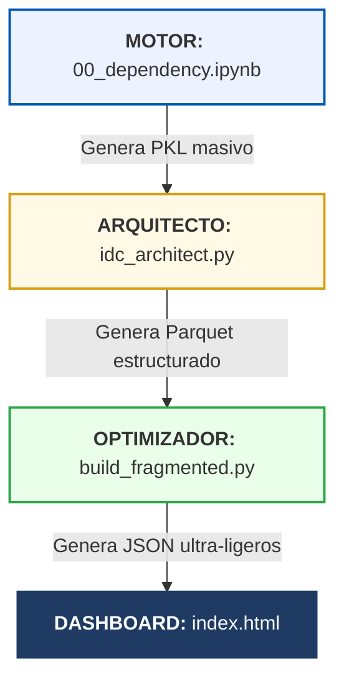

# 📊 IDC — indicador de dependencia comercial
**Real Instituto Elcano**  
> Última actualización: 03/03/2026 — *Versión Multi-año Unificada (V2.1 - Radar de Riesgo Oculto)*

Análisis de dependencias económicas en cadenas de suministro globales. El **IDC** cuantifica la vulnerabilidad de las economías midiendo dependencias directas e indirectas en el comercio bilateral por industria, en un contexto de fragmentación geoeconómica.

---

## 🧠 Metodología del indicador de dependencia comercial (IDC)

El **indicador de dependencia comercial (IDC)** es una métrica avanzada diseñada por el **Real Instituto Elcano** para identificar y cuantificar la vulnerabilidad de las naciones ante interrupciones en las cadenas globales de suministro. Supera la medición tradicional de "volumen de comercio" al enfocarse en la **estructura de dependencia** y la **capacidad de sustitución**.

### 1. El Concepto de Dependencia Multi-nivel

El factor diferencial de este proyecto es la distinción entre dos tipos de riesgos:

*   **Dependencia Directa:** Es el riesgo inmediato visible en las aduanas. Si el país A importa el 80% de sus semiconductores del país B, el país A tiene una alta dependencia directa de B.
*   **Dependencia Indirecta (Riesgo Oculto):** El modelo aplica algoritmos de análisis de grafos para rastrear toda la cadena de valor. Si el país B (proveedor directo) depende a su vez del país C para fabricar el semiconductor, el país A tiene una dependencia indirecta de C. El modelo detecta estos cuellos de botella geocéntricos que a menudo pasan desapercibidos en las estadísticas nacionales.

### 2. Cómo se calcula el IDC

El índice se construye siguiendo un proceso de tres etapas:

1.  **Cálculo de la Vulnerabilidad Industrial:** Para cada binomio industria-país, se calcula el peso de las importaciones sobre la producción total y se ajusta según la elasticidad de sustitución (cuán difícil es reemplazar ese insumo localmente o con otros proveedores).
2.  **Identificación de Hubs y Rutas:** Se utiliza el cálculo de centralidad de red para determinar qué países intermedian en más rutas críticas de suministro. Aquellos con un *Hub Score* elevado son puntos de control sistémico.
3.  **Agregación Nacional:** El IDC final de un país es la suma ponderada de las vulnerabilidades de todas sus industrias críticas, normalizada en un rango de 0 a 1 (donde 1 representa la máxima vulnerabilidad sistémica).

### 3. Jerarquía de Procesos y Flujo de Datos

El proyecto sigue una estructura de transformación en tres niveles, asegurando que los cálculos macroeconómicos complejos se conviertan en información visual fluida:

```mermaid
graph TD
    A[<b>MOTOR:</b> 00_dependency.ipynb] -->|Genera PKL masivo| B[<b>ARQUITECTO:</b> idc_architect.py]
    B -->|Genera Parquet estructurado| C[<b>OPTIMIZADOR:</b> build_fragmented.py]
    C -->|Genera JSON ultra-ligeros| D[<b>DASHBOARD:</b> index.html]
    
    style A fill:#ecf2ff,stroke:#0056b3,stroke-width:2px
    style B fill:#fff9e6,stroke:#d4a017,stroke-width:2px
    style C fill:#eaffea,stroke:#28a745,stroke-width:2px
    style D fill:#1f3b64,stroke:#1f3b64,color:#fff,stroke-width:2px
```

#### **Nivel 1: El Cerebro (Motor de Cálculo)**
*   **Script:** `notebooks/analysis/00_dependency.ipynb`
*   **Acción:** Abrir el Notebook y ejecutar todas las celdas. **Importante:** Cambiar la variable `anio` en la celda de configuración (celda 3) para procesar el año deseado (ej: 2015).
*   **Proceso Interno:** 
    1. **Normalización ITP**: Descomprime y filtra la base de datos *International Trade and Production Database* (ITPD-E) usando Dask para paralelismo y aceleración GPU (PyTorch/CUDA).
    2. **Matrices de Transición (T)**: Crea matrices de probabilidad de suministro donde $T[j,i]$ es el peso del proveedor $j$ sobre el total importado por $i$.
    3. **Análisis de Caminos (Paths)**: Calcula dependencias directas ($L=1$) e indirectas (rastreando rutas de $L=2$ hasta $L=5$) mediante la propagación de probabilidades en la red global.
    4. **Scores de Intermediación**: Evalúa la importancia de cada país como "puente" sistémico a través de métricas de frecuencia y fuerza en las rutas críticas.

*   **Salidas:** 
    - `dependencias{año}_borrar.csv.gz`: Resumen legible en tabla de las dependencias país-país por industria.
    - `intermediarios_globales_{año}.parquet`: Detalle profundo del rol de cada país como hub, desglosado por sector.
    - `country_profiles_{año}.parquet`: Radiografía de vulnerabilidad y exposición de cada país por industria.
    - `relaciones_criticas_{año}.parquet`: Alertas de seguridad (dependencia > 70% y bajos caminos alternativos).
    - `caminos_significativos_{año}.parquet`: Catálogo de las rutas comerciales más fuertes por sector.
    - `all_results_{año}.pkl`: El "mapa genético" completo del año (~1.4GB). Es el archivo que consume el **Arquitecto**.

#### **Nivel 2: El Arquitecto (Estructuración)**
*   **Script:** `notebooks/analysis/idc_architect.py`
*   **Acción:** Ejecutar en terminal: `py notebooks/analysis/idc_architect.py [AÑO]` (ej: `py notebooks/analysis/idc_architect.py 2015`).
*   **Proceso Interno:**
    1. Filtra y destila el `.pkl` masivo.
    2. Calcula los **Scores de Hubs** (centralidad) y rankings globales.
    3. Identifica **Relaciones Críticas** (aquellas con alta dependencia y pocos proveedores alternativos).
*   **Salida:** Archivos `.parquet` temáticos en `data/processed/historico/` (optimizados para análisis rápido).

#### **Nivel 3: El Puente (Optimización Web)**
*   **Script:** `dashboard_prototype/build_fragmented.py`
*   **Acción:** Ejecutar en terminal: `py dashboard_prototype/build_fragmented.py`.
*   **Proceso Interno:**
    1. Detecta automáticamente los años procesados en el nivel anterior.
    2. Aplica **filtros de relevancia** (enfocado en España y riesgos sistémicos > 10%).
    3. Transforma tablas a **formato de matriz comprimida** (`c:` columnas, `d:` datos) para reducir el peso de descarga.
    4. Genera el archivo `dashboard_elcano.html` inyectando el logo y configurando el modo multi-año.
*   **Salida:** `dashboard_prototype/data_dist/*.json` y el dashboard final.

---

---

## 🏗️ Prototipo "Lite" vs. Sistema de Producción

Para facilitar la visualización inmediata y el despliegue en **GitHub Pages**, el repositorio incluye un sistema de generación de datos "Lite".

### 1. El Generador de Juguete (`build_toy.py`)
Este script crea una versión reducida pero 100% funcional del ecosistema de datos:
- **Reducción de Escala:** Selecciona un subconjunto (ej. 30 países) en lugar de los 236 originales.
- **Fragmentación de Archivos:** Genera archivos `data_toy_YYYY.json` individuales por año. Esto permite que el navegador solo descargue el año que el usuario está consultando, optimizando la memoria (archivos de ~7MB vs. el archivo consolidado de +300MB).
- **Propósito:** Validar la UX/UI, probar las visualizaciones y demostrar la capacidad multi-año sin necesidad de un servidor backend.

### 2. El Dashboard (`dashboard_prototype/template.html`)
El frontend está diseñado como una **Single Page Application (SPA)** reactiva que:
- Implementa una arquitectura de carga bajo demanda (Lazy Loading) de archivos JSON.
- Utiliza **Plotly.js** para renderizar mapas coropléticos, globos 3D y radares de riesgo indirecto.
- Mantiene el estado global del año y sincroniza todos los componentes (KPIs, Mapas, Rankings, Explorador) automáticamente al cambiar de periodo.

---

## 🏢 Guía de Handover para Implementación Profesional

Esta sección es crítica para la empresa encargada de la web definitiva. El objetivo es escalar el prototipo actual a una plataforma robusta.

### 📦 El "Contrato" de Datos (API Contract)
El esquema JSON generado por `build_toy.py` debe considerarse como la especificación técnica de la API. Si el backend profesional sirve JSONs con la misma estructura que `data_toy.json`, el frontend funcionará con el 100% de los datos sin cambios significativos.

**Campos clave que la API debe servir:**
- `kpis`: Resumen estadístico global por año.
- `map_data`: Valores del IDC por país (ISO3) para el mapamundi.
- `hubs_data`: Rankings de intermediación y scores de centralidad.
- `explorer_indexed`: (Crítico) Un diccionario indexado por `industry_id` que contiene las rutas de dependencia directa e indirecta.
- `target_year`: El año de los datos servidos.
- `available_years`: Lista de periodos disponibles para el selector.

### 🚀 Hoja de Ruta de Escalabilidad
1.  **Backend vs. Archivos Estáticos:** Abandonar los archivos `.json` estáticos. El backend debe consultar los archivos `.parquet` ubicados en `data/processed/historico/` (fuente de verdad procesada).
2.  **Motor 추천 (Recomendado):** Utilizar **DuckDB** en el servidor. Permite realizar consultas SQL analíticas sobre archivos Parquet en milisegundos.
3.  **Migración a Framework Pro:** Se recomienda portar la lógica de `template.html` (Javascript Vainilla) a **Next.js (React)** o **Nuxt (Vue)** para mejorar la gestión de estados complejos y SEO.
4.  **Optimización de Búsqueda:** Implementar la búsqueda de países e industrias mediante una base de datos vectorial o un índice simple en el backend, evitando cargar los nombres de 170 industrias y 230 países en el cliente.
5.  **Visualización Premium:** Sustituir los mapas de Plotly por soluciones más fluidas como **Mapbox GL** o **Deck.gl** si se requiere manejar miles de flujos comerciales simultáneos.

---

## 🛠️ Requisitos Técnicos

-   **Python 3.10+ (usar `py` en Windows)**
-   **Lanzar Dashboard Local:** `py -m http.server 8000` (desde `dashboard_prototype`)
-   **GPU NVIDIA:** Altamente recomendada para el motor de cálculo (`00_dependency.ipynb`).
-   **Dependencias Core:** pandas, numpy, torch, plotly, pyarrow (para manejo de Parquet).

---

## 👥 Equipo (Real Instituto Elcano)
-   Manuel Alejandro Hidalgo
-   Miguel Otero

---
*Este proyecto es propiedad del Real Instituto Elcano. El código y los datos generados son para fines de análisis estratégico de seguridad económica.*
