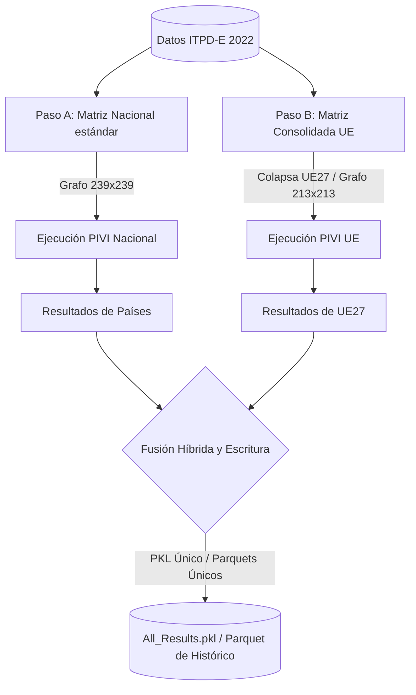

# 🇪🇺 Metodología de Agregación de la Unión Europea (IDEE)
> **Directorio:** `notebooks/analysis/research_archives/sandbox_UE/`  
> **Fecha:** Julio 2026

Este documento detalla los fundamentos matemáticos, económicos y de diseño de software para integrar a la **Unión Europea (UE27)** como una entidad única en el **Índice de Dependencia Económica Elcano (IDEE)**, conviviendo de manera híbrida con sus 27 países miembros individuales sin alterar el funcionamiento del dashboard desarrollado por IBM.

---

## 1. Justificación Matemática: Agregación de Matrices vs. Medias Ponderadas

Para obtener las métricas de la UE consolidada, existen dos alternativas teóricas. La matemática de redes demuestra que solo una de ellas es válida:

### ❌ Opción A: Medias Ponderadas de Resultados Finales
Consiste en tomar los resultados de dependencias del cálculo nacional estándar y promediar los de los 27 miembros ponderándolos por su PIB o volumen comercial.
*   **Fallo de No-Conmutatividad:** El cálculo del IDEE se basa en la multiplicación de matrices de transición no lineales ($T^L$) para caminos de longitud $L \ge 2$. La agregación de nodos y las potencias matriciales no conmutan:
    $$\text{PIVI}(\text{Agregación}(G)) \neq \text{Agregación}(\text{PIVI}(G))$$
*   **Doble Contabilización:** El comercio dentro de la Unión Europea (p. ej., España comprando a Alemania) se contabilizaría como una dependencia. Si Alemania a su vez depende de China, al ponderar los resultados parecería que la UE tiene una dependencia indirecta de China a través de Alemania, cuando en realidad, siendo Alemania parte de la misma entidad, es una **dependencia directa** de la UE con China.
*   **Falsa Diversificación (Sesgo del HHI):** Si los 27 países importan de sus vecinos comunitarios, sus índices de concentración individuales (HHI) son bajos (parecen diversificados). Al promediar, el HHI medio de la UE parecería muy seguro. Sin embargo, si colectivamente todos importan en última instancia de un monopolio externo (ej: China para tierras raras), la UE como bloque está altamente vulnerable. Solo colapsando la matriz se revela el HHI real del bloque frente a terceros.

###  Opción B: Colapsar la Matriz de Comercio Bruto (Matriz Agregada)
Consiste en consolidar los flujos comerciales *antes* de iniciar el pipeline algorítmico:
1.  Se define el conjunto de países miembros de la UE.
2.  Se suman todos los flujos de exportación e importación de los 27 países hacia/desde el resto del mundo bajo la etiqueta `EU27`.
3.  Toda transacción interna entre los 27 miembros (intra-UE) pasa a formar parte de la diagonal (autoconsumo/comercio interno) de `EU27`, anulando su impacto en el cálculo de dependencias externas.
4.  Se ejecuta el algoritmo PIVI sobre esta matriz consolidada.

---

## 2. El Peligro del "Mezclado de Escalas" (Scale-Mixing)
Si creamos una única matriz de tamaño $(N+1) \times (N+1)$ que contenga a la vez los 27 países individuales **y** al nodo `EU27`, el algoritmo de caminos de red generará rutas inválidas como:
$$\text{China} \to \text{España} \to \text{EU27} \to \text{EE. UU.}$$
Donde España exporta a la UE (de la cual España ya forma parte), creando bucles circulares ficticios y distorsionando las centralidades globales de los hubs.

### La Solución: Pipeline de Ejecución Dual (Dual-Execution)
Para lograr un modelo híbrido limpio, el motor de cálculo ejecutará el algoritmo en dos pasadas independientes y luego fusionará sus outputs:



*   **Paso A (Normal):** Calcula las dependencias exactas a nivel de país soberano (España mantiene sus dependencias de Alemania, Francia, etc.).
*   **Paso B (Consolidado):** Calcula el perfil y los caminos exactos para `EU27` como bloque.
*   **Paso C (Fusión):** Combina ambos resultados en un único archivo de salida. La entidad `EU27` se añade como un país importador más.

---

## 3. Guía de Integración para el Dashboard (IBM)

Para que los desarrolladores de IBM puedan incorporar esta información sin rehacer el frontend, se les deben facilitar las siguientes directrices:

1.  **Exclusión de Rankings Colectivos (Filtro en JS):**
    Para evitar que "Unión Europea" aparezca listada como un "país" compitiendo contra España o Alemania en gráficos de barras de vulnerabilidad global, deben filtrar la clave de país en la UI:
    ```javascript
    const paisesParaRankings = data.profiles.filter(p => p.country !== 'EU27');
    ```
2.  **Mapeo Cartográfico (Pintar 27 Polígonos):**
    Dado que las librerías de mapas (Plotly.js, Mapbox) no poseen la geometría de `EU27`, cuando el usuario seleccione "Unión Europea" en la UI, el mapa del dashboard debe pintar los 27 polígonos de los países miembros usando el valor asociado a la entidad `EU27`:
    ```javascript
    const codigosUE = ['AUT', 'BEL', 'BGR', 'CYP', 'CZE', 'DEU', 'DNK', 'EST', 'ESP', 'FIN', 'FRA', 'GRC', 'HRV', 'HUN', 'IRL', 'ITA', 'LTU', 'LUX', 'LVA', 'MLT', 'NLD', 'POL', 'PRT', 'ROU', 'SVK', 'SVN', 'SWE'];
    
    if (selectedCountry === 'EU27') {
        codigosUE.forEach(iso => pintarPais(iso, valor_EU27));
    }
    ```
3.  **Visualización Bilateral:**
    Cuando el usuario esté en la pestaña "Industria Explorer" y seleccione "Unión Europea" como importador, el gráfico mostrará sus dependencias directas e indirectas de proveedores no comunitarios (como China o EE. UU.), ocultando a socios internos de forma natural.
